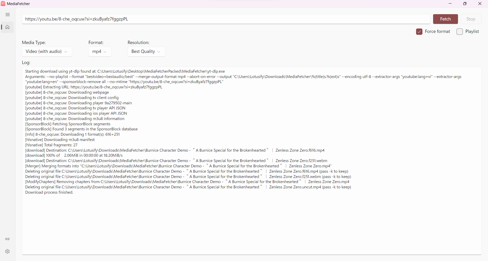
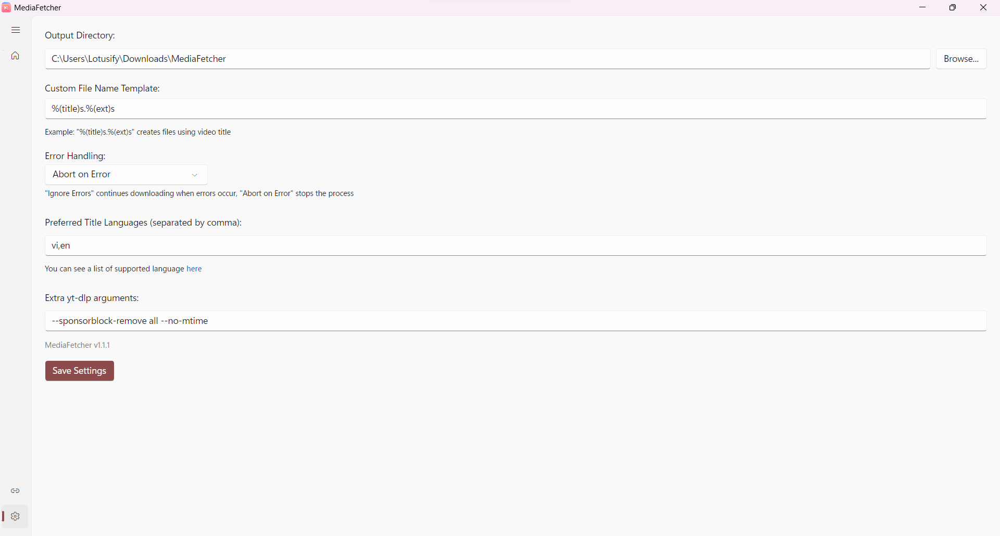

# MediaFetcher

👋 Welcome to MediaFetcher! This little app aims to make downloading media easier using the power of yt-dlp.

## 📝 Description

MediaFetcher provides a user-friendly interface to download video and audio from various websites supported by [yt-dlp](https://github.com/yt-dlp/yt-dlp).
It allows users to easily select formats, resolutions, and other options without needing to use the command line directly.
You can check supported websites [here](https://github.com/yt-dlp/yt-dlp/blob/master/supportedsites.md).

## 🖼️ Screenshots

## ✨ Features

* **URL Input**: Simple text box to paste the URL of the media you want to download.
* **Media Type Selection**: Choose between downloading:
  * Video with Audio (default)
  * Video Only
  * Audio Only
* **Format Selection**:
  * Video Formats: mp4, webm, mkv
  * Audio Formats: mp3, m4a, opus, aac, flac, wav, vorbis
* **Resolution Selection**: Choose video resolution from 144p up to 8K, including "Best" and "Worst" options.
* **Playlist Handling**: Option to download entire playlists or just the single video specified by the URL.
* **Force Format**: Option to force recoding or merging into the selected output format (requires `ffmpeg` to be available to `yt-dlp`).
* **Custom Output**:
  * Specify a custom output directory.
  * Define a custom filename template using `yt-dlp` syntax (default: `%(title)s.%(ext)s`).
* **Download Management**:
  * View real-time download progress and speed.
  * See detailed logs from `yt-dlp`.
  * Cancel ongoing downloads.
* **Error Handling**: Configure how download errors are handled (None, Ignore Errors, Abort on Errors).
* **Settings Persistence**: Saves configuration (output path, filename template, error handling) to a `settings.json` file.
* **Preferred Metadata Language**: Set a preferred language code (e.g., `vi`, `en`) for YouTube titles/descriptions in Settings.
* **Custom Arguments**: Add extra command-line arguments for `yt-dlp` via the Settings page for advanced use cases.

## 🛠️ Requirements

Both provided download versions are **self-contained** and include the necessary .NET runtime. **No separate .NET installation is required for either version.**

The difference lies in the inclusion of external tools:

* **📦 Packed Version**
  * Download the **"Packed"** version (`*Packed.zip`) from the [Releases](https://github.com/lotusify/MediaFetcherAvalonia/releases/latest) page.
  * Includes the application AND the `yt-dlp` and `ffmpeg` executables. Ready to run out of the box.

* **💨 No Dependencies Version**
  * Download the **"NoLibrary"** version (`*NoLibrary.zip`)from the [Releases](https://github.com/lotusify/MediaFetcherAvalonia/releases/latest) page.
  * Includes the application but **does NOT include `yt-dlp` or `ffmpeg`**.
  * **Requires `yt-dlp`**: You must provide your own `yt-dlp` executable. Place it in the application folder or ensure it's in your system's PATH. Download from the [official yt-dlp GitHub repository](https://github.com/yt-dlp/yt-dlp).
  * **Requires `ffmpeg` (Optional but really recommended)**: You should provide your own `ffmpeg` executable for best results (merging, format conversion). Place it with `yt-dlp` or ensure it's in PATH. Download from [here](https://ffmpeg.org/download.html).
  * Choose this if you prefer to manage/update `yt-dlp` and `ffmpeg` yourself.

## 🚀 Usage

1.  Make sure you have the necessary requirements installed (see Requirements section), *or* use the "Packed" version from Releases.
2.  Run the `MediaFetcher` executable.
3.  Paste the URL of the media you want to download into the URL box.
4.  Select the desired Media Type, Format, and Resolution.
5.  Check/uncheck Playlist and Force Format options as needed.
6.  Click the "Download" button.
7.  Monitor progress and logs in the text area below.
8.  Use the "Cancel" button to stop a download.
9.  Navigate to the "Settings" page (⚙️ gear icon) to configure the output directory, filename template, preferred language, custom arguments, and error handling. Click "Save Settings" to apply changes.

## ⚠️ Current Limitations

* **Manual Dependency Installation**: Does not automatically download or install `yt-dlp` or `ffmpeg` (unless using the Packed release version).
* **No Playlist Item Selection**: When downloading a playlist, the entire playlist is downloaded; there is no option to select specific videos from it.
* **Limited Customization**: Lacks basic options like theme selection.
* **Manual Dependency Management**: Does not manage `yt-dlp`/`ffmpeg` updates or versions; users must handle this themselves (unless using the Packed release version).
* **Missing Advanced Options**: Does not include many advanced `yt-dlp` features like SponsorBlock integration, etc., unless added via Custom Arguments.

## 🤔 Feedback

Found a bug or have a suggestion? Feel free to open an issue on GitHub!

## 🙏 Disclaimer

**Please Note:** This application was developed as a school project, with significant help from AI tools during development. It serves as a learning exercise!
